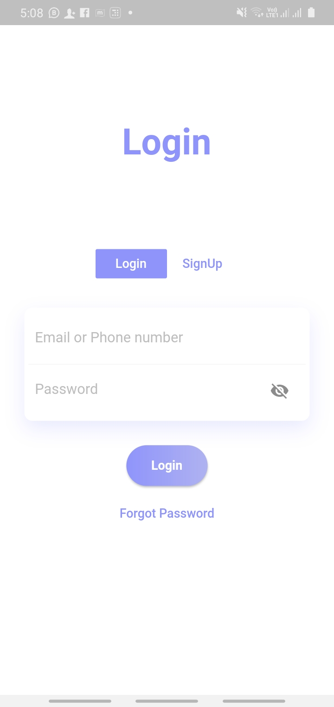
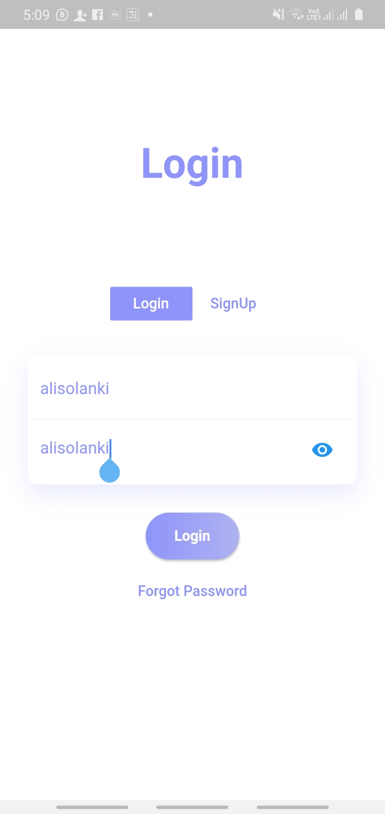

# Flutter Login and SignUp Page

> Simple Flutter Login and SignUp Page.

---
## Screenshots]

             

## Contributing

> To get started...

### Step 1

- **Option 1**
    - 🍴 Fork this repo!

- **Option 2**
    - 👯 Clone this repo to your local machine using `https://github.com/alisolanki/LoginPage.git`

### Step 2

- **HACK AWAY!** 🔨🔨🔨

### Step 3

- 🔃 Create a new pull request using <a href="https://github.com/alisolanki/LoginPage/compare/" target="_blank">`https://github.com/alisolanki/LoginPage/compare/`</a>.

---

## Author
<table>
  <tr>
    <td align="center"><a href="http://www.alisolanki.gq"> <b>Ali Solanki</b></a> 💻</a>
    </td>
  </tr></table>

---

## License

- **[MIT license](http://opensource.org/licenses/mit-license.php)**
- Copyright 2020 © <a href="https://www.alisolanki.gq" target="_blank">Ali Solanki</a>.
